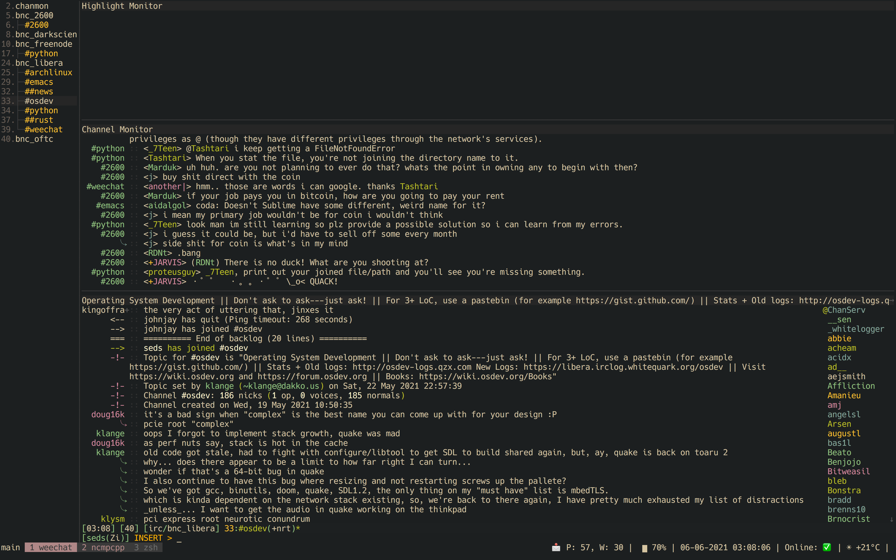
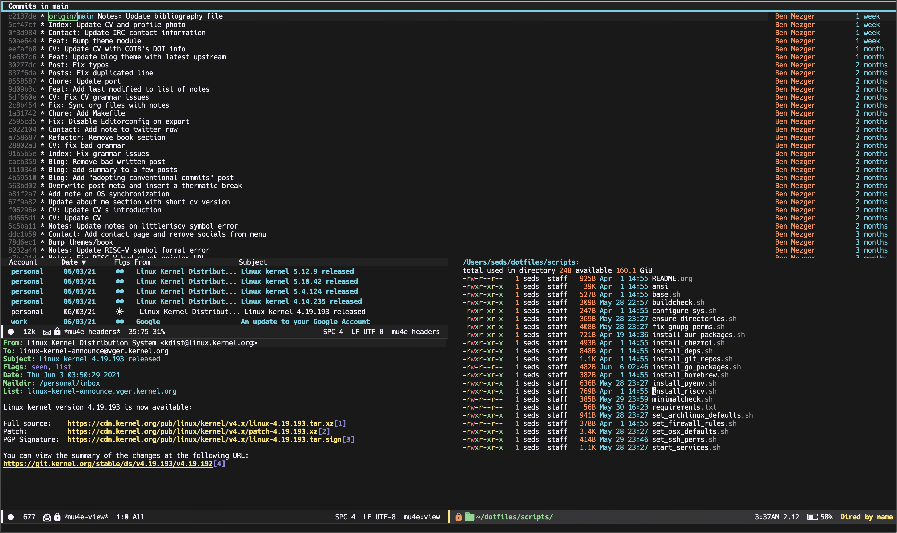

## Installing this configuration

### Requirements

- Chezmoi
- Archlinux or OSX

### Installing

**Note:** You need to set the `env` variable `SECRETS_OFF=1` to disable
bitwarden. Not passing will make chezmoi fail when connecting to my bitwarden's
account ¯\_(ツ)_/¯.

The following environment variables can be set to configure chezmoi when
applying changed:

- `ASK`: Set to `1` if you want to enable chezmoi prompt
- `SECRETS_OFF`: Set to `1` to enable Bitwarden (uses my personal secrets set in
  `.chezmoi.yaml`)
- `DOTFILES_MINIMAL`: Set to `1` if you want to install the minimal version
- `WORKCONF`: Set to `1` to enable work configuration (work email, etc)

For example: `ASK=1 chezmoi apply` to enable prompt or `DOTFILES_MINIMAL=1
chezmoi apply` for applying the minimal version.

#### Install with chezmoi

```shell
SECRETS_OFF=1 chezmoi init https://github.com/benmezger/dotfiles.git -S ~/dotfiles
```

#### Minimal version

The minimal version installs only the essentials.

- zsh
- git
- vim
- emacs
- tmux
- curl
- alacritty
- neovim
- user-dirs
- editorconfig
- dircolors

```shell
SECRETS_OFF=1 DOTFILES_MINIMAL=1 chezmoi init https://github.com/benmezger/dotfiles.git -S ~/dotfiles
```

#### Makefile

You can clone this repository and use the Makefile to apply the changes +
install dependencies.

``` shell
make apply or make all
make fix-permissions
make install-required-dependencies
make install-extra-dependencies
make install-pyenv
make install-go-dependencies
make install git-dependencies
make configure-osx
make configure-linux
```

## Keybindings

### OSX

- `fn + cmd - e` - opens emacs
- `fn + cmd - i` - opens firefox
- `fn + cmd - f` - opens finder in $HOME
- `cmd + return` - opens alacritty

#### MPC

- `fn + cmd - f1` - mpc play
- `fn + cmd - f2` - mpc pause
- `fn + cmd - f3` - mpc prev
- `fn + cmd - f4` - mpc next
- `fn + cmd - f5` - mpc volume -10
- `fn + cmd - f6` - mpc volume +10

## Troubleshooting

### Chezmoi does not seem to reload the configuration

Run `chezmoi init <dotfiles-path>` again. This should reload the configuration
by copying [chezmoi.yaml](.chezmoi.yaml.tmpl) to `$HOME/.config/chezmoi/chezmoi.yaml`.

### Sourcing env with i3

For some reason, i3 is sourcing `.xprofile` instead of `xinitrc`, so for
getting Github plugin for the [i3status-rust](dot_config/i3/status.toml) you need to set up a variable in
your `.xprofile`

```shell
export I3RS_GITHUB_TOKEN="your-github-token"
```

## Screenshots

### OSX


### Archlinux


### Weechat IRC



### Emacs



## Contributing

1. Feel free to contribute and/or report issues.
