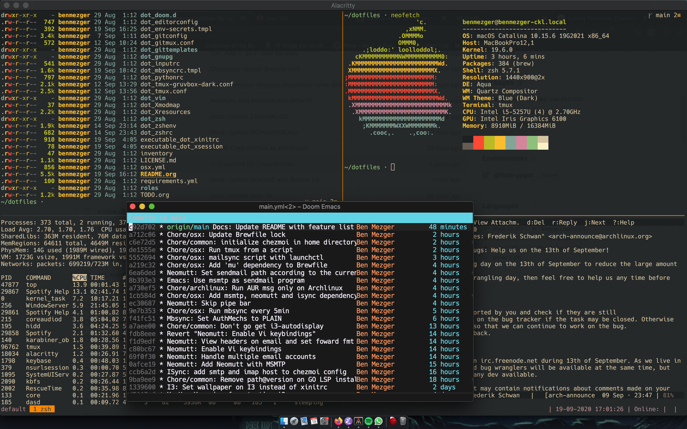
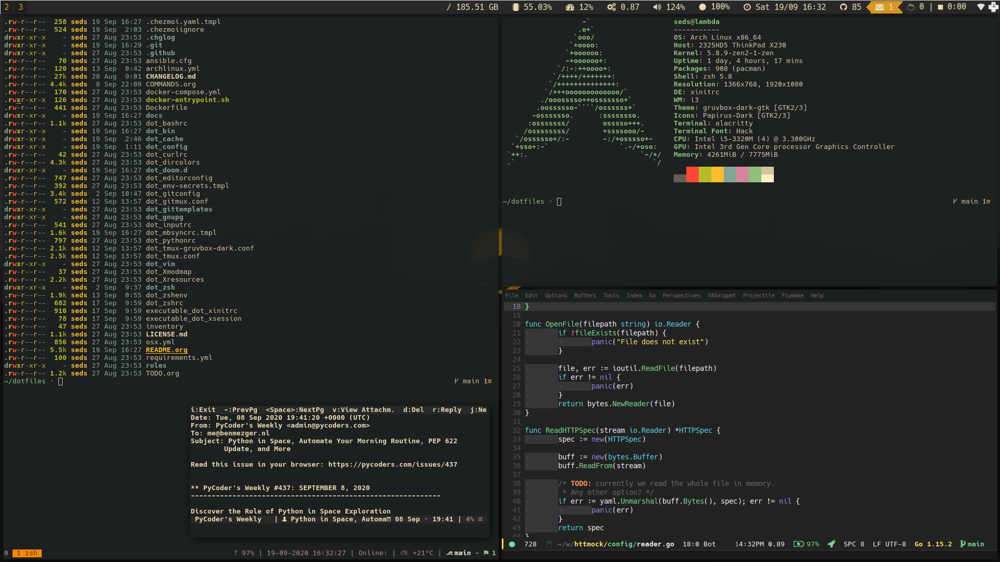
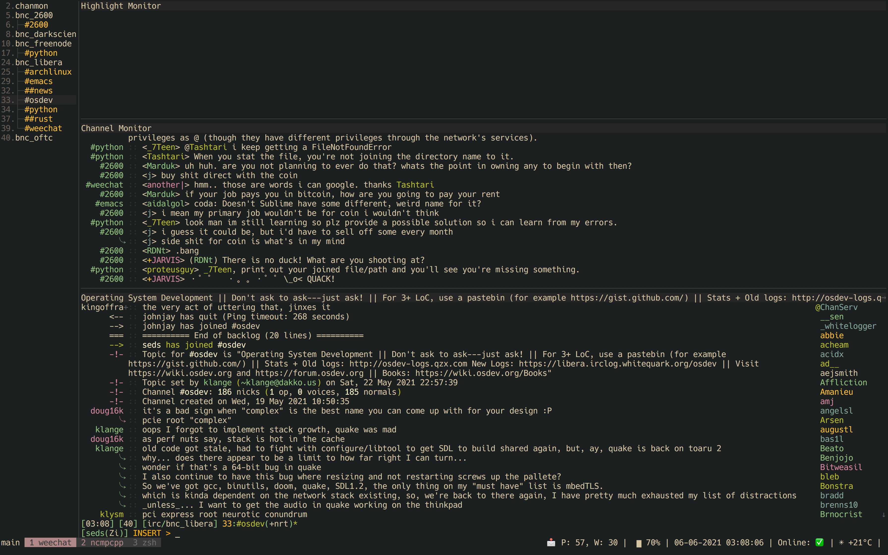
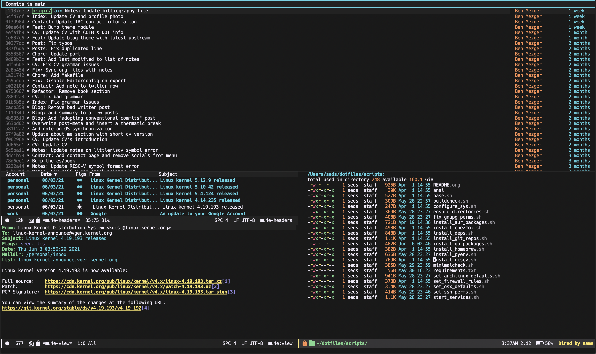

# Ben Mezger's `.dotfiles`
My personal dotfiles.

You will find my `dotfiles` in the
[`chezmoi`](https://github.com/benmezger/dotfiles/tree/main/chezmoi)
directory.

## Requirements

- [Chezmoi](http://chezmoi.io/)
- Arch Linux or MacOS

## Installation

**⚠️ Note:** _If you're not me, you won't have access to my 1Password
account. To prevent chezmoi from applying files with secrets, set the
`SECRETS_OFF=1` environment variable. If you do not use this flag,
chezmoi will fail when attempting to connect to my 1Password account
¯\\\_(ツ)\_/¯._

```shell
SECRETS_OFF=1 chezmoi init https://github.com/benmezger/dotfiles.git -S ~/dotfiles
```

I recommend using my `.dotfiles` as a reference rather than applying
them directly. They contain many personal configurations that may not
suit your setup, and some depend on specific files, packages, and
directory structures (e.g. org-mode files in Emacs).

## Applying changes
Use `chezmoi` to apply the dotfiles:

``` shell
chezmoi apply -v
```

## Environment Variables

The following environment variables can be used to configure `chezmoi`
during initialization and when applying changes:

- `ASK`: Set to `1` to enable prompts in `chezmoi`.
- `SECRETS_OFF`: Set to `1` to disable 1Password integration (uses my
  personal secrets defined in `.chezmoi.yaml`).
- `DOTFILES_MINIMAL`: Set to `1` to install the minimal version of the
  dotfiles.
- `WORKCONF`: Set to `1` to enable work-related configurations (e.g.,
  work email, etc.).
- `LAPTOP_MODE`: Set to `1` when running on a laptop and not desktop.

For example, run `ASK=1 chezmoi apply` to enable prompts or
`DOTFILES_MINIMAL=1 chezmoi apply` to generate the minimal
configuration.

## Troubleshooting

### Chezmoi is not reloading the configuration

Run `chezmoi init <dotfiles-path>` again. This will reload the
configuration by regenerating [chezmoi.yaml](.chezmoi.yaml.tmpl) in
`$HOME/.config/chezmoi/chezmoi.yaml`.

## Screenshots

### macOS



### Arch Linux



### Weechat IRC



### Emacs



## Contributing

1. Feel free to contribute and/or report any issues.
